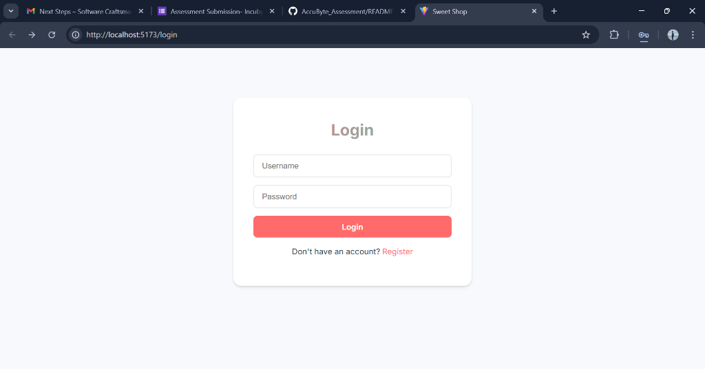
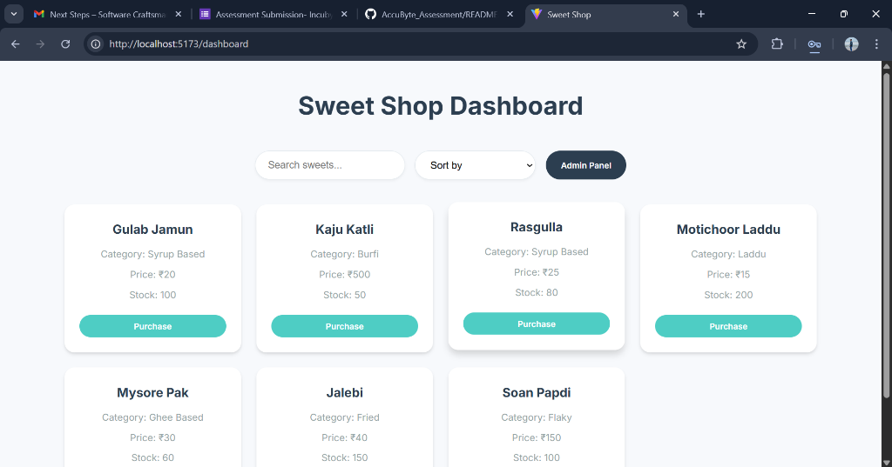
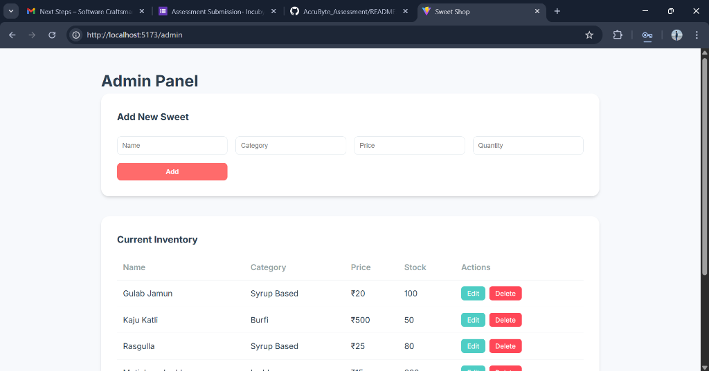

# Sweet Shop Management System

A full-stack application for managing a sweet shop's inventory, sales, and user authentication.

## Tech Stack
- **Backend**: Node.js, Express.js, TypeScript
- **Database**: SQLite, Prisma ORM
- **Frontend**: React, Vite, TypeScript
- **Testing**: Jest

## Setup Instructions

### Prerequisites
- Node.js (v18+)
- npm

### Backend Setup (Terminal 1)
1.  Navigate to the project root:
    ```bash
    cd sweet-shop-management
    ```
2.  Install dependencies:
    ```bash
    npm install
    ```
3.  **Optional**: Seed the database with sample sweets (if empty):
    ```bash
    npx ts-node prisma/seed.ts
    ```
4.  Start the backend server:
    ```bash
    npm run dev
    ```
    - Server runs on: `http://localhost:3000`
    - View Database content: `npx prisma studio` (opens in browser)

### Frontend Setup (Terminal 2)
1.  Navigate to the `client` folder:
    ```bash
    cd client
    ```
2.  Install dependencies:
    ```bash
    npm install
    ```
3.  Start the React app:
    ```bash
    npm run dev
    ```
    - App runs on: `http://localhost:5173`
    - Open this URL in your browser to use the app.

## Screenshots

### Login Page


### Dashboard


### Admin Panel


## Features
- **User Authentication**: Register and Login (JWT-based).
- **Dashboard**: View sweets, search by name, sort by price, and purchase items.
- **Admin Panel**: Add, edit, and delete sweets. Manage inventory.
- **Inventory Management**: Real-time stock updates.

## API Endpoints
- `POST /api/auth/register` - Create account.
- `POST /api/auth/login` - Authenticate user.
- `GET /api/sweets` - List all sweets.
- `GET /api/sweets/search` - Search sweets.
- `POST /api/sweets` - Add sweet (Admin).
- `PUT /api/sweets/:id` - Update sweet (Admin).
- `DELETE /api/sweets/:id` - Delete sweet (Admin).
- `POST /api/sweets/:id/purchase` - Purchase sweet.
- `POST /api/sweets/:id/restock` - Restock sweet.

## My AI Usage
I leveraged AI assistance to enhance my development workflow, while maintaining full control over the system design and core logic.

- **Architecture & Design**: I designed the full-stack architecture independently. AI provided specific tool recommendations (like Prisma and Vite) to fit my requirements.
- **Implementation**: I developed the core API logic myself. AI assisted by generating boilerplate code, speeding up the implementation of standard components, and helping write the majority of the code under my direction.
- **Testing**: I used AI to generate comprehensive unit tests to verify the APIs I built.
- **Refactoring & Debugging**: AI was helpful for refactoring code for performance and resolving configuration and debugging issues.

## License
MIT
